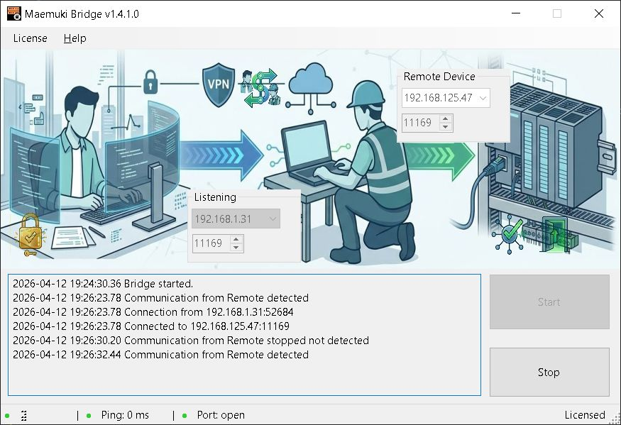

# Maemuki bridge

Overview
--------

Maemuki bridge is a small bridge application intended for use by field service engineers (FSE) who work onsite at customer facilities. The tool lets an FSE expose a remote device on the local site network (typically a PLC or other industrial controller) to an engineer in the office by using the FSE laptop as a communication bridge.

Typical scenario:

- An FSE is onsite and can reach a customer's PLC from their laptop
- The FSE has a VPN connection that places their laptop on the same routed network (or otherwise reachable) from the office engineer
- The FSE runs maemuki bridge to map the device's network endpoint through the laptop so the office engineer can connect to the PLC as if it were on their own network

Key benefits

- Enables remote troubleshooting, configuration, and commissioning without requiring permanent network changes at the customer site
- Simple configuration and operation for FSE staff

Architecture / How it works
--------------------------

The application runs on the FSE laptop and forwards one or more network endpoints from the customer's local network to the FSE laptop. The office engineer connects to the FSE laptop (over the company VPN or other secure channel) and accesses the forwarded endpoint(s). The bridge itself is a TCP (or other supported transport) forwarder — it does not modify the protocol payloads.

Requirements
------------

- Windows (the repository targets .NET 10; install the appropriate .NET 10 runtime)
- A working VPN connection if the office engineer must reach the FSE laptop across the corporate network
- Appropriate firewall rules and permissions to allow incoming connections to the laptop on the selected ports
- Local network access from the FSE laptop to the target device (PLC)

Security considerations
-----------------------

- Only run maemuki bridge with management consent and on networks where you are authorized to forward traffic
- Use VPN and company authentication systems to ensure only authorized engineers can reach the FSE laptop
- Keep the laptop patched and run with minimal required privileges
- Restrict forwarded ports and use short-lived sessions when possible

Quick install
-------------

1. Install .NET 10 runtime on the FSE laptop (download from Microsoft if not already installed). [Download .NET 10.0 (Linux, macOS, and Windows) | .NET](https://dotnet.microsoft.com/en-us/download/dotnet/10.0)
2. Copy the maemuki bridge application files to a folder on the laptop (for example: C:\\maemuki bridge\\)

Configuration
-------------

There is no editable configuration JSON describing forwards in this repository. The GUI reads a simple hosts.json file that contains a map of friendly names to target IP addresses. The application uses these entries to populate the "Forward host" dropdown; it does not use a Forwards array or ListenAddress field.

hosts.json format (example):

{
  "PLC-1": "192.168.1.10",
  "PLC-Backup": "192.168.1.11"
}

Notes:

- The file must be named hosts.json and placed next to the WinForms executable (the GUI) so the program can load it (AppContext.BaseDirectory).
- Each property is a name (displayed in the dropdown) with a string value containing the target IP address.
- If hosts.json is missing or cannot be parsed, the dropdown will be empty and you may type an IP address directly into the Forward host field. The UI also provides a "Custom" option to enter arbitrary addresses.
- The actual port and listen interface are configured from the UI controls (Listen Port, Forward Port, Listen Interface) and passed to the core executable when starting the proxy.

How the FSE operates (step-by-step)
-----------------------------------

1. Start the bridge on the laptop. Example (PowerShell):
   
   cd C:\maemuki bridge
   dotnet maemuki bridge.exe

2. Verify network access to the target device from the laptop. Just selecting the device or the IP address, the program shows if the device answer to ping.

3. Verify the port in the device is open. Just selecting the right port, the program shows if the port in the device is opened

4. Ensure the VPN is active and that the engineering team can reach the laptop over the VPN.

5. Give the office engineer the public/virtual IP or VPN name of the laptop and the ListenPort (for example, laptop-vpn.example.com:15002).

How the engineer in the office connects
--------------------------------------

1. From the office, make sure your machine is on the company network or VPN that can reach the FSE laptop.

2. Use the appropriate client protocol to connect to the forwarded endpoint. Examples:
   
   - Modbus TCP client -> connect to laptop-vpn.example.com:15002
   - SSH/telnet client -> connect to the mapped host and port if those are forwarded

3. The bridge transparently forwards traffic to the PLC's IP:LocalPort on the site network.

Example
-------

FSE laptop: 10.8.0.12 (VPN address)
PLC on site: 192.168.1.10:502
Bridge mapping: ListenPort 15002 bound to 10.8.0.12

Engineer connects to 10.8.0.12:15002 with a Modbus client.

Troubleshooting
---------------

- Connection refused on ListenPort: check that maemuki bridge is running, and Windows Firewall allows inbound traffic on the port.
- Cannot reach PLC from laptop: verify LAN connectivity and any local firewall on the PLC.
- Engineer cannot reach laptop: check VPN connectivity and corporate firewall rules; confirm the laptop's VPN address and routing.

Support and further notes
-------------------------

If you need additional mappings, add more entries to the Forwards list. Keep mappings minimal and remove them when work is complete.

For development or debugging, run the application with verbose logging (if available) and collect logs for diagnostics.

License and attribution
-----------------------

This repository contains the maemuki bridge application. Review the repository license for details on use and distribution.
